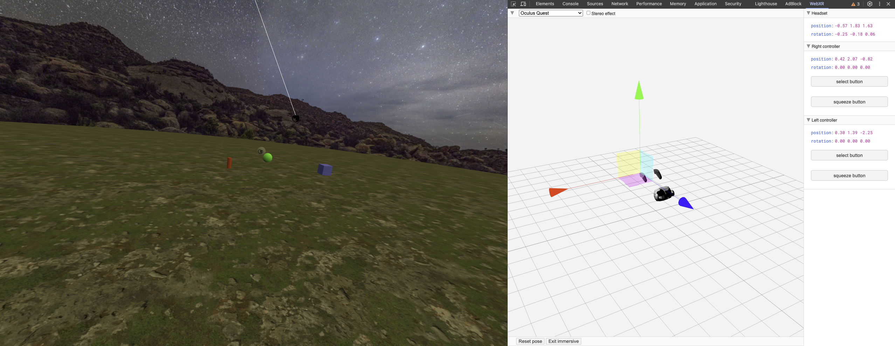

# Basic Three.js VR Scene

A simple static WebXR-enabled virtual reality scene built with Three.js, featuring interactive controllers and object manipulation. The entire project runs directly in the browser with no build steps required.



## Table of Contents

- [Basic Three.js VR Scene](#basic-threejs-vr-scene)
  - [Table of Contents](#table-of-contents)
  - [Overview](#overview)
  - [Features](#features)
    - [Core Features](#core-features)
    - [Interaction Features](#interaction-features)
  - [Prerequisites](#prerequisites)
  - [Getting Started](#getting-started)
    - [Installation](#installation)
    - [Running the Project](#running-the-project)
  - [Documentation](#documentation)
    - [WebXR Setup](#webxr-setup)
    - [Scene Components](#scene-components)
    - [Controller Setup](#controller-setup)
    - [WebAR Support](#webar-support)
  - [Code Examples](#code-examples)
    - [1. Enabling WebXR and Adding the VR Button](#1-enabling-webxr-and-adding-the-vr-button)
    - [2. Adding a Sky and Ground](#2-adding-a-sky-and-ground)
    - [3. Loading FBX Models](#3-loading-fbx-models)
    - [4. Controllers and "Grab" Interactions](#4-controllers-and-grab-interactions)
    - [5. Raycast with the Left Controller](#5-raycast-with-the-left-controller)
  - [Development](#development)
  - [Resources](#resources)
  - [Additional Documentation](#additional-documentation)
  - [License](#license)
  - [License](#license-1)

## Overview

This repository provides a basic [Three.js](https://threejs.org/) setup for **WebXR**, allowing you to experience a virtual reality (VR) scene directly in the browser. It uses **VRButton** to enter VR mode and demonstrates interaction with objects through controllers, object grabbing, and basic raycasting.

## Features

### Core Features

- 🌍 **Immersive Environment**
  - **Skybox** (using `SphereGeometry` with a texture)
  - **Ground** plane (texture repeated over a large area)
  - **Multiple FBX Models** (loaded via `FBXLoader` and placed at different coordinates)

### Interaction Features

- 🎮 **VR Controllers** using `XRControllerModelFactory`, including:
  - **Grab** nearby objects when the right controller is close enough
  - **Raycast** with the left controller (pull objects in or relocate them)
- 🔄 **Runtime Options**
  - Support for both **WebVR** and **WebAR** (switchable via `VRButton` or `ARButton`)
  - Cross-platform compatibility

## Prerequisites

- A WebXR-compatible browser
- For VR testing:
  - A compatible VR headset, or
  - [WebXR Emulator Extension](https://github.com/MozillaReality/WebXR-emulator-extension) for desktop testing
  - [WebXR Viewer](https://apps.apple.com/us/app/webxr-viewer/id1295998056) for iOS testing

## Getting Started

### Installation

1. Clone the repository:

```bash
git clone https://github.com/usuario/basic-threejs-vr-scene.git
```

2. Navigate to the project directory:

```bash
cd basic-threejs-vr-scene
```

### Running the Project

1. Open in your browser:

   - For desktop: Use Chrome with WebXR flags enabled
   - For Android: Use Chrome
   - For iOS: Use WebXR Viewer app

2. Click "Enter VR" or "Enter AR" to start the experience

## Documentation

### WebXR Setup

The project uses the latest WebXR standards and provides compatibility across different platforms. For detailed setup instructions, refer to the documentation in the `docs` folder.

### Scene Components

Detailed information about the scene setup, including:

- Environment textures
- Object placement
- Lighting setup
- Performance optimizations

### Controller Setup

Implementation details for VR controllers, including:

- Controller model loading
- Event handling
- Interaction zones
- Haptic feedback

### WebAR Support

For AR implementation, the project supports:

- Device camera integration
- Surface detection
- Object placement
- Touch interactions

## Code Examples

### 1. Enabling WebXR and Adding the VR Button

```js
import { VRButton } from 'https://unpkg.com/three@0.126.0/examples/jsm/webxr/VRButton.js';

renderer = new THREE.WebGLRenderer({ antialias: true, alpha: true });
renderer.xr.enabled = true; // <-- Enable WebXR
document.body.appendChild(renderer.domElement);
document.body.appendChild(VRButton.createButton(renderer));

renderer.setAnimationLoop(render);
```

### 2. Adding a Sky and Ground

```js
// Texture loader
let textureLoader = new THREE.TextureLoader();

// Sky
const textureSky = textureLoader.load('path/to/sky-texture.jpg');
const materialSky = new THREE.MeshBasicMaterial({
  map: textureSky,
  side: THREE.DoubleSide,
});
const sky = new THREE.Mesh(new THREE.SphereGeometry(30, 32, 32), materialSky);
scene.add(sky);
```

### 3. Loading FBX Models

```js
import { FBXLoader } from 'https://unpkg.com/three@0.126.0/examples/jsm/loaders/FBXLoader.js';

new FBXLoader().load('path/to/Tree(1).fbx', (object) => {
  object.traverse((child) => {
    object.scale.set(0.004, 0.004, 0.004);
    createTree(object.clone(), [0, 0, -10]);
    createTree(object.clone(), [5, 0, -3]);
    // ...
  });
});

function createTree(tree, position) {
  tree.position.set(position[0], position[1], position[2]);
  scene.add(tree);
}
```

### 4. Controllers and "Grab" Interactions

```js
import { XRControllerModelFactory } from 'https://unpkg.com/three@0.126.0/examples/jsm/webxr/XRControllerModelFactory.js';

// Controllers
const controllerModelFactory = new XRControllerModelFactory();
controllerL = renderer.xr.getControllerGrip(0);
controllerR = renderer.xr.getControllerGrip(1);

scene.add(controllerL);
scene.add(controllerR);

// Right Controller: Grab
let checkGrabbingR = false;
controllerR.addEventListener('selectstart', () => (checkGrabbingR = true));
controllerR.addEventListener('selectend', () => (checkGrabbingR = false));

function CheckObjects() {
  // If within a certain radius, snap object to controllerR
  objects.forEach((obj) => {
    let dist = obj.position.distanceTo(controllerR.position);
    if (dist <= controllerActionRadius) {
      obj.position.copy(controllerR.position);
    }
  });
}

function render() {
  if (checkGrabbingR) CheckObjects();
  renderer.render(scene, camera);
}
```

### 5. Raycast with the Left Controller

```js
controllerL.addEventListener('squeezestart', SelectEventRay);

function SelectEventRay() {
  const intersections = getIntersections(controllerL);
  intersections.forEach((intersection) => {
    if (objects.includes(intersection.object)) {
      intersection.object.position.copy(controllerL.position);
    }
  });
}

function getIntersections(controller) {
  const tempMatrix = new THREE.Matrix4();
  const raycaster = new THREE.Raycaster();

  tempMatrix.identity().extractRotation(controller.matrixWorld);
  raycaster.ray.origin.setFromMatrixPosition(controller.matrixWorld);
  raycaster.ray.direction.set(0, 0, -1).applyMatrix4(tempMatrix);

  return raycaster.intersectObjects(scene.children);
}
```

## Development

For development, we recommend:

1. Using the WebXR Emulator Extension for rapid testing
2. Following the Three.js best practices
3. Testing across different devices and browsers
4. Using the provided debugging tools

For more details, see our [Contributing Guidelines](CONTRIBUTING.md).

## Resources

- [Three.js Documentation](https://threejs.org/docs/)
- [WebXR Device API](https://developer.mozilla.org/en-US/docs/Web/API/WebXR_Device_API)
- [WebXR Emulator Extension](https://github.com/MozillaReality/WebXR-emulator-extension)
- [WebXR Viewer for iOS](https://apps.apple.com/us/app/webxr-viewer/id1295998056)

## Additional Documentation

The project draws on the following **WebXR** documentation:

- **WebXR Emulator Extension** (to emulate VR/AR devices on a desktop):  
  [MozillaReality/WebXR-emulator-extension](https://github.com/MozillaReality/WebXR-emulator-extension)
- **iOS App for WebXR** (to run VR/AR experiences on Apple devices):  
  [WebXR Viewer on AppStore](https://apps.apple.com/us/app/webxr-viewer/id1295998056)

For a detailed explanation of the starter scene, VR/AR setup, environment textures, and controller events, you can refer to the documentation text provided in this repo (or the excerpt in the project's docs folder).

## License

This project is licensed under the [MIT License](LICENSE).
